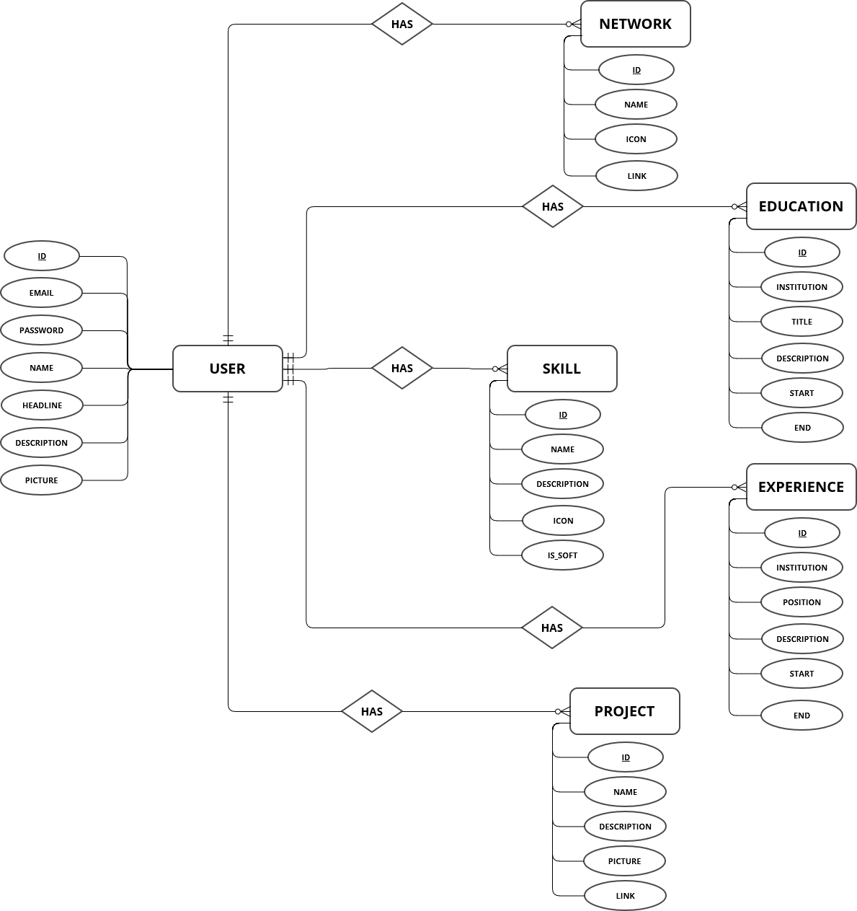

# Repository for my portfolio Back end

## Linked to the deployed version

https://portfolio-9c331.web.app

Be aware that it may take up to a five minutes to process the first request (probably'll be getting the user data) to the API since I it is using a free tier of Render for the backend.

## Description

Here you can find the backend API that I built for my [Portfolio Repository.](https://github.com/martincalsina/Portfolio-back-end)

## Used Technologies

- Spring Boot 3.2.1 (Web, Data JPA, DevTools)
- Flyway 9.22.3
- Lombok 1.18.30
- MySQL 8.0
- JDK 17

You cand find all of them in the `pom.xml` file

## Features and Principal functionalities

The API has controllers for each of the Data Base entities that can be seen in the following ERD

For each of them, we have an `Entity`, `Repository`, `Service` (which also containes each implementation of those interfaces), `Controller` and `DTO` packages. 

Each entity supports all the CRUD methods that were nedeed for the Frontend. The connection to the database is managed by the `application.properties`
file. There is no need to create anything more than a schema called `portfolio`. Flyway will create the needed tables.